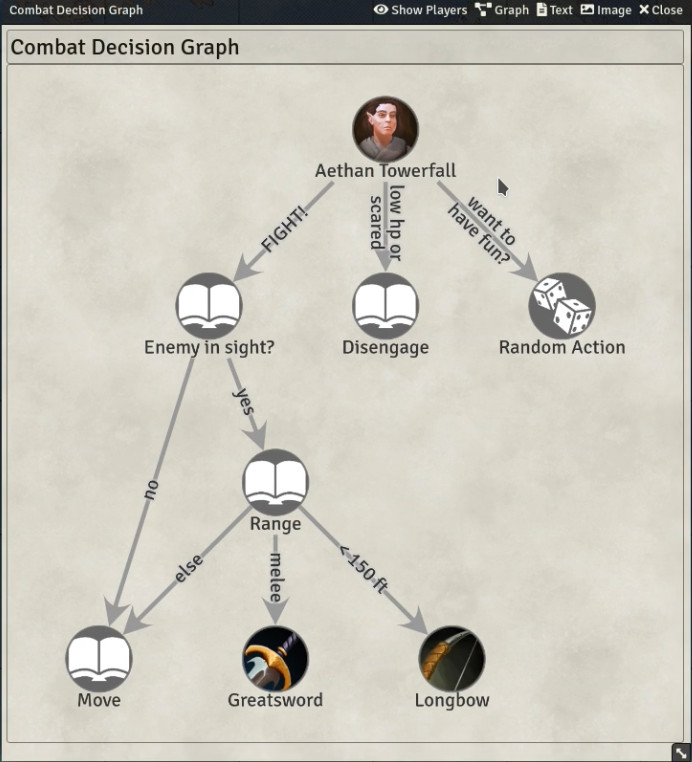

# **MINDMAP** - Moerills Indecision Negator, Decision Maker, And Planner

## This is currently a BETA release!

<!-- 
  
 
   
-->

This module for [Foundry VTT](https://foundryvtt.com/) adds a third view to each Journal Entry: The MindMap View.  
In this view you organize you can create a network graph for organizing your relations, flow charts, campaign structures, ideas or whatever you can imagine! Just Drag the data from the sidebar to begin planning.

## ~~ READ FIRST ~~

This module is still in a BETA version!  
This being said i'm pretty confident that the basic usage does work rather well.  
This release is mainly to gather feedback on usage and gather feature suggestions.
To keep in touch and keep this organized, *PLEASE* use this gitlabs [Issue Tracker](https://github.com/p4535992/foundryvtt-mindmap/issues) for suggestions and bugs. Also before you submit an issue or suggestion, make sure its not submitted already.  

## Installation

It's always easiest to install modules from the in game add-on browser.

To install this module manually:
1.  Inside the Foundry "Configuration and Setup" screen, click "Add-on Modules"
2.  Click "Install Module"
3.  In the "Manifest URL" field, paste the following url:
`https://raw.githubusercontent.com/p4535992/foundryvtt-mindmap/master/src/module.json`
4.  Click 'Install' and wait for installation to complete
5.  Don't forget to enable the module in game using the "Manage Module" button

### libWrapper

This module uses the [libWrapper](https://github.com/ruipin/fvtt-lib-wrapper) library for wrapping core methods. It is a hard dependency and it is recommended for the best experience and compatibility with other modules.

### Creating your first graph
Start up FVTT, connect to a world, choosee a Journal Entry and click on *MindMap* in the titlebar. Now you will see a canvas filling the journal, just drag Entities from the sidbar onto it. If you drag an entity onto an already existing Node it will automatically create a directed edge from the existing node to the newly created one.  

## Advanced
### View the nodes sheet
You can double click a node to view its sheet.

### Context Menu
Press and hold the right mouse button on a Node or an Edge for more options. Just drag your mouse pointer onto the option you want to choose and release the right mouse button to choose it.  

#### Node Menu
* Open Sheet: Opens the sheet
* Add Edge: Choose another node to create a directed edge to.
* Toggle visited: Marks the node as visited.
* Delete: Deletes the Node and all edges attached to it.

#### Edge Menu
* Modify Label: Type to add a label to the node
* Toggle Direction: Changes the direction of the edge. Switches between directed and undirected, while toggling the direction.
* Delete: Deletes the edge

### Controls
Drag the canvas to move around, mouse wheel to zoom.

### Layouts
You can choose a layout using the settings menu in the bottom left corner. Physics simulated layouts tend to be slower than the others.  
Available Layouts:
* Manual: You can choose the position of your nodes yourself. **Tip**: Set a layout you like, switch to manual and adjust afterwards. This also removes the possible randomness of the physics based layouts.
* Grid
* Circle
* Concentric: Tries to organize nodes in concentric circles
* Breadthfirst: Organizes nodes in a hierarchy, based on a breadthfirst traversal of the graph. Results in a tree or forest like structure if the graph is similar to one.
* [Dagre](https://github.com/cytoscape/cytoscape.js-dagre)
* [Klay](https://github.com/cytoscape/cytoscape.js-klay)
* [fast Compound Spring Embedder](https://github.com/iVis-at-Bilkent/cytoscape.js-fcose): Physics simulation to position the nodes.
* [Spread](https://github.com/cytoscape/cytoscape.js-spread): Physics simulation trying to use the whole viewport space.
* [CiSE (Circular Spring Embedder)](https://github.com/iVis-at-Bilkent/cytoscape.js-cise): Physics simulation trying to create circular clusters.
* [Cola](https://github.com/cytoscape/cytoscape.js-cola): Physics simulation, smooth animation, "focused on aesthetically pleasing results for small graphs".
* Random: Randomizes node position.

## Attribution
This project uses [Cytoscape.js](https://js.cytoscape.org/) licensed under the MIT license. It also uses the following Cytoscape.js extensions, all licensed under the MIT license:
* [Edgehandles](https://github.com/cytoscape/cytoscape.js-edgehandles)
* [CxtMenu](https://github.com/cytoscape/cytoscape.js-cxtmenu)
* [Compound Drag and Drop](https://github.com/cytoscape/cytoscape.js-compound-drag-and-drop)

All layouts used are linked above and licensed under the MIT license.

Art used as placeholder images for nodes does come from (game-icons.net)[https://www.game-icons.net] and is licensed under [CC BY 3.0](https://creativecommons.org/licenses/by/3.0/).

This project uses the [Foundry Project Creator](https://gitlab.com/foundry-projects/foundry-pc/create-foundry-project) by N. van Oosten. 

## License
This module is licensed under [GNU LGPL v3](https://raw.githubusercontent.com/p4535992/foundryvtt-mindmap/master/LICENSE) and Foundry Virtual Tabletops [Limited License Agreement For Module Development](https://foundryvtt.com/article/license/).

## [Changelog](./changelog.md)

## Issues

Any issues, bugs, or feature requests are always welcome to be reported directly to the [Issue Tracker](https://github.com/p4535992/foundryvtt-mindmap/issues ), or using the [Bug Reporter Module](https://foundryvtt.com/packages/bug-reporter/).

## Acknowledgements

Bootstrapped with Nick East's [create-foundry-project](https://gitlab.com/foundry-projects/foundry-pc/create-foundry-project).

Mad props to the 'League of Extraordinary FoundryVTT Developers' community which helped me figure out a lot.

## Credit

Thanks to anyone who helps me with this code! I appreciate the user community's feedback on this project!

- [Mindmap](https://gitlab.com/moerills-fvtt-modules/graphs) ty to [Moerill](https://github.com/Moerill/)
